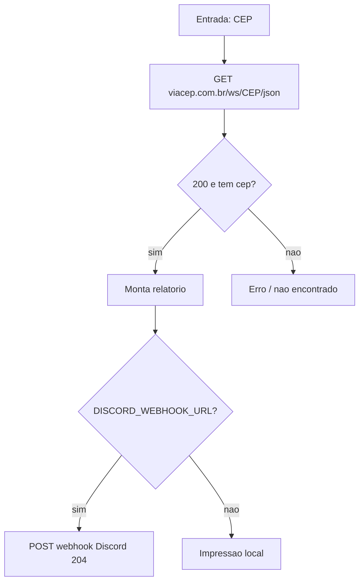

# 📮 CEP-Scraping
<p align="center">
  
  <a href="https://github.com/panda12332145/CEP-Scraping/commits/main"></a>
  <a href="https://github.com/panda12332145/CEP-Scraping"></a>
  
</p>
---
> ⚠️ **Nota:** o envio ao Discord é **opcional** e configurado pela variável de ambiente `DISCORD_WEBHOOK_URL` — nenhuma URL de webhook fica hardcoded no código.

---
## 🔖 Resumo

Script Python que consulta a **API ViaCEP** a partir de um CEP digitado, formata o resultado (logradouro, bairro, cidade, UF, IBGE...) e pode enviar a resposta para um canal do Discord via webhook — de forma opcional, através de variável de ambiente.

### ✨ Funcionalidades Principais

- ✅ Consulta CEP via API pública ViaCEP
- ✅ Formatanização dos campos em tupla/relatório
- ✅ Envio opcional ao Discord via `DISCORD_WEBHOOK_URL`
- ✅ Mensagens claras de erro (CEP não encontrado / falha HTTP)

## 📽 Demonstração

```text
$ python Cep_Scraping.py
Digite o CEP solicitado: 30140071
CEP: 30140071
Logradouro: Praça Sete de Setembro
Bairro: Centro
Localidade: Belo Horizonte
UF: MG
...
```

## ⚙️ Explicação das Partes Importantes

### Consulta ViaCEP

```python
cep = int(input('Digite o CEP solicitado: '))
api_cep = f'https://viacep.com.br/ws/{cep}/json/'
response = requests.get(api_cep)
```

> Monta a URL da API e busca o JSON; `status_code == 200` + chave `cep` confirmam o resultado.

### Webhook opcional via ambiente

```python
webhook_url = os.environ.get("DISCORD_WEBHOOK_URL", "")
if not webhook_url:
    print(resultado_string)   # só imprime localmente
else:
    requests.post(webhook_url, data=json.dumps(payload), headers=headers)
```

> Padrão seguro: sem variável de ambiente o resultado só é exibido; o webhook nunca é gravado no repositório.

## 🔄 Fluxo de Trabalho / Arquitetura



## 📂 Estrutura do Projeto

```plaintext
CEP-Scraping/
├── Cep_Scraping.py   # Script principal
└── README.md
```

## 🛠️ Tecnologias

| Ferramenta | Uso |
|---|---|
| **Python 3** | Linguagem |
| **requests** | Requisições HTTP |
| **ViaCEP API** | Fonte de dados |
| **Discord Webhook** | Notificação opcional |

## ▶️ Instalação

```bash
git clone https://github.com/panda12332145/CEP-Scraping.git
cd CEP-Scraping
pip install requests

# opcional — notificações no Discord:
export DISCORD_WEBHOOK_URL="https://discord.com/api/webhooks/ID/TOKEN"
```

## 🚀 Execução

```bash
python Cep_Scraping.py
```

## ⚠️ Limitações

- CEP convertido com `int` (aceita só dígitos)
- Depende da disponibilidade da API ViaCEP

## 🚀 Roadmap

- [ ] Modo lote (lista de CEPs)
- [ ] Cache local de consultas
- [ ] Formatação em tabela

## 📄 Licença

Todos os direitos reservados ao autor.

---

## 👾 Autor

<p align="center">
  
</p>

<p align="center">Feito por <strong>Panda12332145</strong> 👋🏽</p>

---

## 🧑‍💻 Sobre Mim

Sou apaixonado por **Física Teórica, Cibersegurança e Desenvolvimento de Sistemas**. Tenho grande interesse em programação de baixo nível, engenharia reversa, automação, sistemas Windows, criptografia e segurança ofensiva. Também gosto bastante de música, filosofia e computação avançada.

---

## 🌐 Redes

* **Site:** [https://panda-h0me.netlify.app/](https://panda-h0me.netlify.app/)
* **YouTube:** [https://www.youtube.com/@X86BinaryGhost](https://www.youtube.com/@X86BinaryGhost)
* **Instagram:** [https://www.instagram.com/01pandal10/](https://www.instagram.com/01pandal10/)
* **GitHub:** [https://github.com/panda12332145](https://github.com/panda12332145)
* **LinkedIn:** [linkedin.com/in/athos-da-boanergis](https://www.linkedin.com/in/athos-d%C3%A3-boanergis-5585a4288/)

---

## 🚀 Áreas de Interesse

* **Cibersegurança Avançada** 🔒
* **Hacking & Engenharia Reversa** 💻
* **Computação de Baixo Nível** 🖥️
* **Matemática e Física Teórica** 📐⚛️
* **Desenvolvimento de Ferramentas de Segurança** 🛠️

_"Conhecimento é poder, e domínio técnico vem da compreensão profunda dos sistemas."_

---

## 📞 Contato & Suporte

Para colaborações, dúvidas ou sugestões:

📧 **E-mail:** [athos.cybersec@gmail.com](mailto:athos.cybersec@gmail.com)

🐛 **Reportar Bug:** [Abrir Issue](https://github.com/panda12332145/CEP-Scraping/issues)

💡 **Sugerir Melhoria:** [Discussions](https://github.com/panda12332145/CEP-Scraping/discussions)

## 📊 Métricas

<!-- metrics:start -->
| Métrica | Valor |
|---|---|
| ⭐ Stars | 0 |
| 🍴 Forks | 0 |
| 📌 Issues abertas | 0 |
| 🕐 Último commit | 2026-09-29 |
<!-- metrics:end -->
